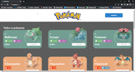

# Projeto Pokedex - Labenu

## Índice
- <a href="#funcionalidades">Funcionalides do Projeto</a>
- <a href="#layoult">Layoult</a>
- <a href="#demonstracao">Demonstração</a>
- <a href="#-tecnologias-utilizadas">Tecnologias utilizadas</a>
- <a href="#descricao">Descrição do Projeto</a>
- <a href="#autor">Autor</a>
- <a href="#passos">Próximos passos</a>

## 📱Funcionalidades do Projeto

- [x] Página inicial onde passui a lista de pokémons
- [x] Página da pokédex
- [x] Página de detalhes
- [x] Botões para para mudar de páginas
- [x] Botão de adicionar à pokédex
- [x] Botão de remover da pokédex
- [x] Botão de Capturar o pokémon para a pokédex e link para detalhes dentro do card do pokémon 

## 💻Layoult

## 💿Demonstração

- ["Link demonstração"](pokedex-lucas-marques.surge.sh)

## 🛠Tecnologias utilizadas

1. [React JS](https://pt-br.reactjs.org/)
2. [React Router](https://reactrouter.com/en/main)
3. [Chakra UI](https://chakra-ui.com/)
4. [Styled Components](https://styled-components.com/)

## 🖨Descrição do Projeto

Ao entrar na página inicial, pode-se escolher entre ver o detalhe do pokémon ao clicar no botão detalhes, ou capturar o pokémon à sua pokédex ao clicar no botão adicionar.
 
Ao clicar no botão Pokédex no canto superior direito, será redirecionado à página da pokédex, onde é possível ver os pokémons adicionados à pokédex, ver os detalhes de qualquer pokémon adicionado, ou retirá-lo da pokédex clicando no botão remover, e ainda poderá retornar à página inicial ao clicar em Todos os Pokémons no canto superior esquerdo.
 
Na página de detalhes é possível ver todos os detalhes do pokémon selecionado, é possível retornar para a página inicial clicando em Todos os Pokémons no canto superior esquerdo, e também é possível adicionar o pokémon caso ainda não esteja na pokédex, ou excluí-lo caso ele já esteja capturado, no botão do canto superior direito.

## 🖋Autor

- Lucas Marques
- Email: lucas.marks8@gmail.com
- Tel: 11 96997-5003
- ["Linkedin"](https://www.linkedin.com/in/lucas-henrique-marques/)